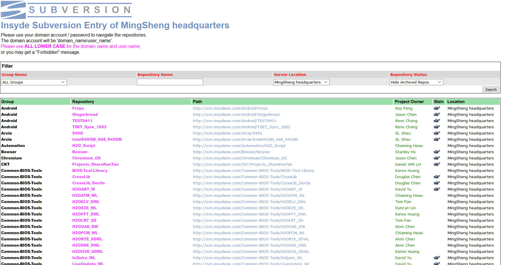

## Gerrit

### Web Portal
* Projects
  - [InQuire_WL / flask-git-repos](http://inquire.insyde.com:3000/InQuire_WL/flask-git-repos)

Git Web Portal 是模仿公司內部 SVN Server 的既有網站行為，使用 [Flask](http://flask.pocoo.org/) 所打造的入口網站。公司所導入的 Git Server 使用的是 [Gerrit Code Review](https://www.gerritcodereview.com/)，由於 Gerrit 舊版本的 UI 界面不是太親民，而新版本的 UI 還在開發階段尚未完善且不一定會導入，因此透過一外部網站使用 [Gerrit REST API](https://gerrit-review.googlesource.com/Documentation/rest-api.html) 來取得 Project 列表與相關資訊，並加上額外的 `Group` 與 `Owner` 欄位來方便分類管理

* 既有的 SVN 入口網站

### Plugin
* Projects
  - [kevin.chen / gitiles](http://inquire.insyde.com:3000/kevin.chen/gitiles)

Gerrit 本身並沒有提供 Web UI 來顯示 Source Code，通常是透過 [GitWeb](https://review.openstack.org/Documentation/config-gitweb.html) 或是 [Gitiles](https://gerrit.googlesource.com/gitiles/) 來呈現。GitWeb 使用 Perl CGI 來實作，Gitlies 則是基於 [JGit](https://www.eclipse.org/jgit/)、[Eclipse Jetty](https://www.eclipse.org/jetty/) 與 [Closure Templates](https://developers.google.com/closure/templates/) 所撰寫的 Git Browser。目前的功能需求是將 [Google Repo Manifest](https://gerrit.googlesource.com/git-repo/+/master/docs/manifest-format.txt) 檔案轉譯為目錄結構呈現，理論上是使用 Gitiles 來實現此功能會比較容易

#### Digression
最近在 GitHub 上看到一個有趣的 Project: [wmhilton/nde](https://github.com/wmhilton/nde)，透過 JavaScript 將 Code `git clone` 至 Client 端顯示。但對於解析 Google Reoo Manifest 這個需求還是在 Server 端處理渲染會比較好
